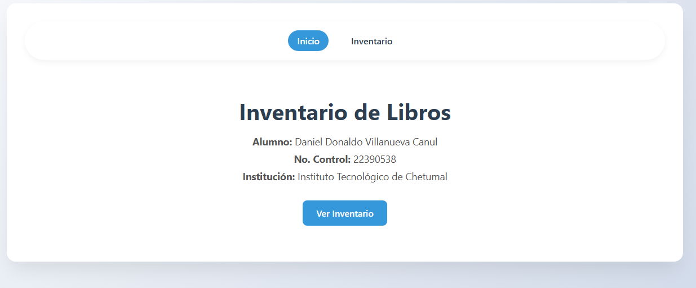
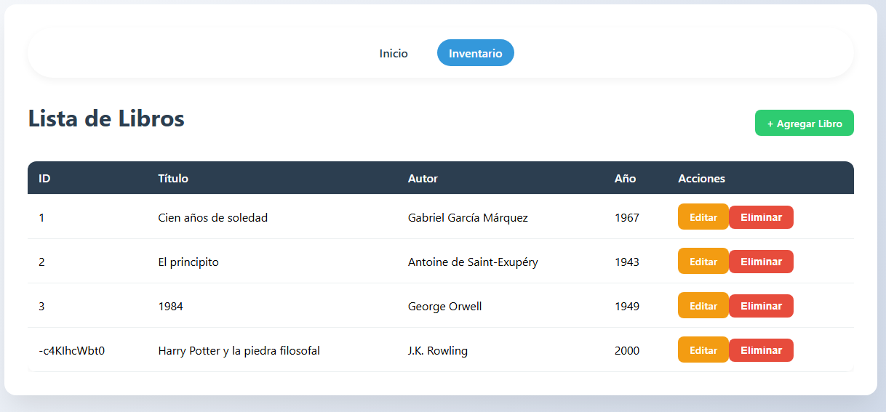

#  Inventario de Libros - Aplicación CRUD con Vue 3

**Alumno:** Daniel Donaldo Villanueva Canul  
**No. Control:** 22390538  
**Institución:** Instituto Tecnológico de Chetumal  

## Descripción

Aplicación web de inventario de libros que permite realizar operaciones CRUD (Crear, Leer, Actualizar, Eliminar) utilizando:

- **Vue 3** con Composition API (`<script setup>`)
- **Vite** como bundler
- **Vue Router** para la navegación
- **Axios** para peticiones HTTP
- **JSON Server** como API REST falsa (backend simulado)

## Características

- Listado de libros con tabla responsive.
- Creación de nuevos libros.
- Edición de libros existentes.
- Eliminación de libros con confirmación.
- Diseño profesional con estilos personalizados y adaptado a móviles.

## Capturas de pantalla

### Página de inicio


### Listado de inventario


## Requisitos previos

- Node.js (versión 18 o superior)
- npm

## Instalación y ejecución

1. Clonar el repositorio:
   ```bash
   git clone https://github.com/VillanuevaDaniel22390538/Tutorial3.git
   cd Tutorial3

   Instalar dependencias:

   ```bash
npm install
Ejecutar el servidor JSON (Terminal 1):

   ```bash
npm run server
El servidor correrá en http://localhost:3001

Ejecutar la aplicación Vue (Terminal 2):

   ```bash
npm run dev
Abrir en el navegador: http://localhost:5173

## Tecnologías utilizadas
Vue 3
Vite
Vue Router 4
Axios
JSON Server
CSS moderno (Flexbox, Grid, diseño responsivo)

## Estructura del proyecto
text
src/
├── assets/           # estilos globales
├── components/       # BookForm.vue (formulario reutilizable)
├── router/           # configuración de rutas
├── views/            # HomeView, BooksView, BookCreateView, BookEditView
├── App.vue
└── main.js


##Créditos
Proyecto basado en el curso de Udemy: "Crea una web app de inventario de libros con Vue 3, Vite y Composition API".
Adaptado y desarrollado por Daniel Donaldo Villanueva Canul para el Instituto Tecnológico de Chetumal.
##Licencia
Uso educativo – sin fines comerciales.